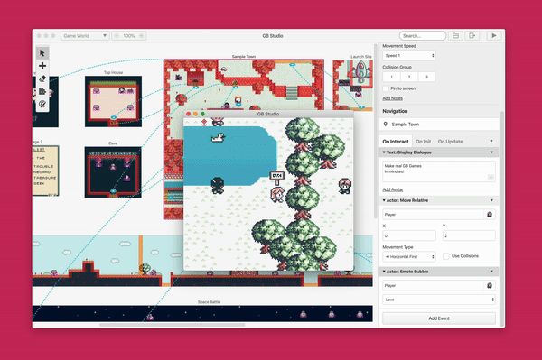

# GB Studio


[](https://circleci.com/gh/chrismaltby/gb-studio/tree/develop)

Copyright (c) 2021 Chris Maltby, released under the [MIT license](https://opensource.org/licenses/MIT).

Twitter: [@maltby](https://www.twitter.com/maltby) 

Reddit: [/r/gbstudio](https://www.reddit.com/r/gbstudio)  
Discord: [Join Chat](https://discord.gg/bxerKnc)


GB Studio is a quick and easy to use retro adventure game creator for Game Boy available for Mac, Linux and Windows.
For more information see the [GB Studio](https://www.gbstudio.dev) site



GB Studio consists of an [Electron](https://electronjs.org/) game builder application and a C based game engine using [GBDK](http://gbdk.sourceforge.net/), music is provided by [GBT Player](https://github.com/AntonioND/gbt-player)

## Installation

Download a release for your operating system from the [GB Studio Downloads](https://www.gbstudio.dev/download) page.

Or to run from source, clone this repo then:

- Install latest stable [NodeJS](https://nodejs.org/)
- Install [Yarn](https://yarnpkg.com/)

```bash
> cd gb-studio
> yarn
> npm start
```

## Build with Docker

With [Docker](https://docs.docker.com/get-docker/) installed and running, run the following commands to build the electron app to the out directory. Next, clone and navigate to the gb-studio source code locally. ***Note: ~30min build time***

```bash
# Start a docker container with node installed, and the source code mounted at /workspace
docker run -it --rm \
    -v ${PWD}:/workspace \
    -w /workspace \
    --entrypoint bash \
    circleci/node:lts-bullseye

# Install dependencies
sudo dpkg --add-architecture i386 \
    && sudo apt-get update \
    && sudo apt-get install -y fakeroot rpm squashfs-tools wine libwine wine32 mono-devel tree \
    && sudo yarn \
    && npm install \
    && npm install --legacy-peer-deps \
    && npm install --force

# Build GB Studio (linux)
sudo yarn make:linux

# Build GB Studio (mac)
sudo yarn make:mac

# Build GB Studio (windows)
sudo yarn make:win

# Build GB Studio (windows 32bit)
sudo yarn make:win32

# Example output/builds
circleci@0f13a4c6cbcf:/workspace$ tree out/make/
out/make/
├── AppImage
│   └── x64
│       └── GB Studio-3.1.0-x64.AppImage
├── deb
│   └── x64
│       └── gb-studio_3.1.0_amd64.deb
├── rpm
│   └── x64
│       └── gb-studio-3.1.0-1.x86_64.rpm
├── squirrel.windows
│   ├── ia32
│   │   ├── GB Studio-3.1.0 Setup.exe
│   │   ├── RELEASES
│   │   └── gb_studio-3.1.0-full.nupkg
│   └── x64
│       ├── GB Studio-3.1.0 Setup.exe
│       ├── RELEASES
│       └── gb_studio-3.1.0-full.nupkg
└── zip
    ├── darwin
    │   └── x64
    │       └── GB Studio-darwin-x64-3.1.0.zip
    └── win32
        ├── ia32
        │   └── GB Studio-win32-ia32-3.1.0.zip
        └── x64
            └── GB Studio-win32-x64-3.1.0.zip

15 directories, 12 files
```

## GB Studio CLI 

Install GB Studio from source as above then

```bash
> npm run make:cli
> yarn link
# From any folder you can now run gb-studio-cli
> gb-studio-cli -V
3.0.0
> gb-studio-cli --help
```

### Update the CLI

Pull the latest code and run make:cli again, yarn link is only needed for the first run.

```bash
> npm run make:cli
```

### CLI Examples

- **Export Project**

    ```bash
    > gb-studio-cli export path/to/project.gbsproj out/
    ```
    Export GBDK project from gbsproj to out directory

- **Export Data**
    ```bash
    > gb-studio-cli export -d path/to/project.gbsproj out/
    ```
    Export only src/data and include/data from gbsproj to out directory
- **Make ROM**
    ```bash
    > gb-studio-cli make:rom path/to/project.gbsproj out/game.gb
    ```
    Make a ROM file from gbsproj
- **Make Web**
    ```bash
    > gb-studio-cli make:web path/to/project.gbsproj out/
    ```
    Make a Web build from gbsproj

## Documentation

[GB Studio Documentation](https://www.gbstudio.dev/docs)

